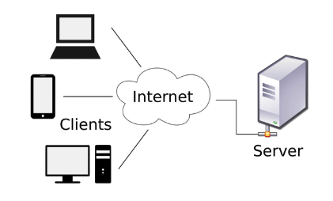
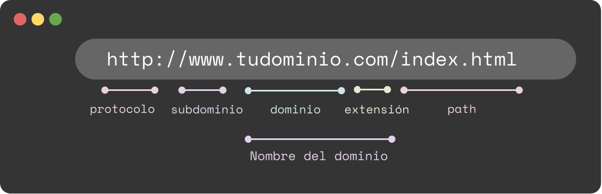

# Intro a la web

## Table of Contents

1. [Redes e Internet](#redes-e-internet)
2. [Desarrollo web](#desarrollo-web)
3. [VS Code](#vs-code)
4. [Terminal](#terminal)
5. [Git](#git)
6. [Github](#github)
7. [Navegador](#navegador)
8. [Html](#html)
9. [Css](#css)
10. [Flexbox](#flexbox)
11. [CSS Grid](#css-grid)
12. [Responsive design](#responsive-design)
13. [Best practices](#best-practices)
14. [Glosario](#glosario)
15. [Recursos](#recursos)
16. [Areas de estudio](#areas-de-estudio)

**Estructura de carpetas sugerida**

* kata-1
  * intro-web-gen24c
  * juanito-intro-web-gen24c
* kata-2
  * intro-js
  * juanito-intro-js

### Redes e internet

#### **¿Qué es una red?**

Es un conjunto de dispositivos informaticos y software conectados entre sí por medio de dispositivos físicos que envían y reciben datos. Una red permite compartir información, recursos y ofrecer servicios.

#### **¿Qué es Internet y qué es la web?**

Es una  **red de computadoras interconectadas a nivel mundial en forma de tela de araña** . Consiste de servidores (o "nodos") que proveen información a aproximadamente 100 millones de personas que están conectadas entre ellas a través de las redes de telefonía y cable.

#### **Arquitectura Cliente-Servidor**

Es una arquitectura que representa una forma de abstraccion para la comunicacion entre dispositvos informaticos o software.

En una arquitectura Cliente-Servidor existe un **servidor** y **múltiples clientes** que se conectan al servidor para recuperar todos los recursos necesarios para funcionar, en este sentido, el cliente solo es una capa para representar los datos y se detonan acciones para modificar el estado del servidor, mientras que el servidor es el que hace todo el trabajo pesado.



#### **Navegadores web**

Es un programa que permite ver la información que contiene una página web. El navegador interpreta el código, HTML generalmente, en el que está escrita la página web y lo presenta en pantalla permitiendo al usuario interactuar con su contenido y navegar.

Para un desarrollador front end es importante comprender que un navegador interpreta 3 lenguajes para renderizar una pagina:

* **Html:** Para definir la estructura.
* **CSS:** Para estilizar el sitio.
* **JS:** Para volver funcional e interactiva la pagina web.

#### **Cómo funcionan los sitios web**

El navegador como cliente solicita al servidor una url desde la que se descargan recursos (html, css, js, img, mp3, etc) y que interpreta para mostrarlos como una pagina web.

#### **Proveedores de Internet**

Un ISP (Internet Service Provider) generalmente es una empresa dedicada a ofrecer servicios de conexciona internet.

#### **Dominios**

Un **dominio web** es el nombre único que recibe un sitio web en internet. Este nombre identifica a una página web concreta sin que puedan existir dos o más sitios web que compartan el mismo nombre de dominio.

A continuacion se muestran las partes de una url, donde se observa que parte corresponde al dominio.



**Protocolo:** Un protocolo es el conjunto de reglas que se establecen para el uso de una determinada tecnologia. El protocolo http/https son protocolos para la comunicacion en internet (transferencia de hypertexto).

**Path:** Es una ruta donde se ubican archivos en un servidor.

#### **Hosting**

Es el alojamiento que tiene un sitio web para poder ser accesible a traves de internet (desde cualquier parte del mundo).

#### **Direcciones IP**

Una direccion IP (Internet Protocol) es la representacion de un dominio mediante 4 octetos de bytes. Sirve para identificar un dispositvo en la red.

**Tipos de IP**

* **Privadas:** Direccion IP que identifica a un dispositivo en una red local.
* **Publicas:** Direccion IP que nos identifica en internet.

#### **Dynamic Host Configuration Protocol (DHCP)**

DHCP  asigna automáticamente direcciones de protocolo de Internet (IP) a los equipos de la red, si la red lo admite .

#### **Domain Name Server (DNS)**

Su función más importante es «traducir» nombres inteligibles para las personas (nombres de dominio) en identificadores binarios (direcciones IP) asociados con los equipos conectados a la red, esto con el propósito de poder localizar y direccionar estos equipos mundialmente.


### Desarrollo web

Tecnologías y herramientas para el desarrollo web

#### **Front end**

* Lenguajes
  * HTML (De marcado de hypertexto).
  * CSS (De estilos en cascada).
  * JavaScript (Lenguaje de programacion).
* Frameworks
  * React.
  * Angular.
  * Vuejs.

#### **Back end**

* Lenguajes de programacion
  * Node.
  * Java.
  * Php.
  * Python.
  * C#.
  * Go.
* Frameworks
  * Express.
  * Spring.
  * Laravel.
  * Django.
  * .NET.
  * Gin.

#### **Gestores de base de datos**

* SQL
  * PostgresSQL.
  * MySQL.
  * SQLServer.
  * Oracle.
  * MariaDB.
* NO SQL
  * MongoDB.
  * DynamoDB.
  * Cassandra.

#### **¿Qué es frontend?**

Es el area de desarrollo enfocada en la construccion de un sitio web. Tanto del diseño y estructura, estilos (colores, fondos, tamaños, animaciones y efectos) e interactividad de los elementos con el usuario.

Es todo el código que se ejecuta en el navegador de un usuario, al que se le denomina una aplicación cliente, es decir, todo lo que el visitante ve y experimenta de forma directa.

#### **¿Qué es backend?**

El backend procesa la información que alimentará el frontend de datos. Es la capa de acceso a los datos, ya sea de un software o de un dispositivo en general, es la lógica tecnológica que hace que una página web funcione, lo que queda oculto a ojos del visitante.

Trabajar en este apartado supone algo totalmente diferente al frontend, ya que exige conocimientos de logica, optimizacion de recursos, seguridad de un sitio, entre otros.

### VS Code

Es un editor de código fuente desarrollado por Microsoft. Es software libre y multiplataforma, está disponible para Windows, GNU/Linux y macOS. VS Code tiene una buena integración con Git, cuenta con soporte para depuración de código, y dispone de un sinnúmero de extensiones, que básicamente te da la posibilidad de escribir y ejecutar código en cualquier lenguaje de programación.

#### **Editor de texto**

Es un [programa informático](https://es.wikipedia.org/wiki/Programa_inform%C3%A1tico "Programa informático") que permite crear y modificar [archivos digitales](https://es.wikipedia.org/wiki/Archivo_(inform%C3%A1tica)) compuestos únicamente por textos sin formato, conocidos comúnmente como [archivos de texto](https://es.wikipedia.org/wiki/Archivo_de_texto "Archivo de texto") o “texto plano”. En ocasiones tienen algunas herramientas para codificar.

#### **Integrated Development Enviroment (IDE)**

Un entorno de desarrollo integrado (IDE) es un software para el diseño de aplicaciones que combina herramientas del desarrollador comunes en una sola interfaz gráfica de usuario (GUI). Generalmente, un IDE cuenta con las siguientes características:

* **Editor de código fuente** : editor de texto que ayuda a escribir el código de software con funciones como el resaltado de la sintaxis con indicaciones visuales, el relleno automático específico para el lenguaje y la comprobación de errores a medida que se escribe el código.
* **Automatización de las compilaciones locales** : herramientas que automatizan las tareas sencillas y repetitivas como parte de la creación de una compilación local del software para que use el desarrollador, como la compilación del código fuente de la computadora en código binario, el empaquetado de ese código y la ejecución de pruebas automatizadas.
* **Depurador** : programa que sirve para probar otros programas y mostrar la ubicación de un error en el código original de forma gráfica.

#### **Extensiones recomendadas**

* Auto Rename Tag.
* Color info.
* Diff.
* Es lint.
* Live share.
* Office viewer (markdown)
* Peacock.
* Vscode/pdf.
* Git graph
* Git blame.
* Comparador de cambios.
* Commits en vscode.

#### **VSCode como editor de git**

```
git config --global core.editor"visual studio --wait"
git commit
// ir a vscode a escribir el mensaje, una vez escrito guardar y cerrar.
// regresar a la consola a comprobar el commit
```

#### Lecturas recomendadas

* [IT Next - Atajos en VS Code](https://itnext.io/vs-code-shortcuts-to-code-like-youre-playing-a-piano-part-2-c27202ea7ea1).
* [Andy Bell - Custom Properties](https://andy-bell.co.uk/my-favourite-3-lines-of-css/).
* [Andy Bell - How the CSS box-sizing property works](https://andy-bell.co.uk/how-the-css-box-sizing-property-works/).
* [Cambia de HEX a RGB a HSL in segundos](https://www.kevinpowell.co/article/change-from-hex-to-rgb-to-hsl-in-seconds-with-vs-code/)

### Terminal

La terminal o consola es una forma generalizada de llamar a la interfaz de línea de comandos: una pantalla (generalmente, de color de fondo negro con letras blancas). Sirve para escribir comandos  con los que ordenamos al sistema realizar acciones concretas.

[Guía para la Terminal enfocado a desarrolladores Frontend](https://www.joshwcomeau.com/javascript/terminal-for-js-devs/).

**Path**

Una ruta o path indica una ubicación a nivel de carpeta de algun fichero dentro del
sistema de archivos.

#### **Ejemplos de rutas**

```
/# Raiz
/

/# Significa ahi mismo
./

/# Regresar un nivel de carpetas../
../../

/# Ir la carpeta home
~/
```

#### Uso de comandos básicos

Listado de comandos

```
# imprime el path en el que se encuentra
pwd

# moverse entre carpetas
cd

# listar carpetas y archivos que hay en el directorio actual
ls

# crear carpetas
mkdir newFolder

# crear archivos
touch nameFile.txt

# eliminar carpetas
rmdir folderName

# eliminar archivos
rm fileName.txt

# comprobar conexión a internet
ping www.google.com

# limpiar la pantalla
clear

```

**Otros ejemplos**

```
cd ..
cd ..
cd ..
cd desktopcd ../../../desktopcd ~/desktop
```

**NOTA:** ctrl + c (detiene procesos en la terminal).

Cuando un comando lleva -x y letras son PARAMETROS de como se debe ejecutar.

### Git

Git es un sistema de control de versiones.

Github es el repositorio remoto a donde podemos respaldar el codigo.

#### Commits Atómicos

Consiste en realizar un commit por un solo objetivo. Es decir, no mezclar muchas soluciones en el mismo commit.

#### Conventional Commits

Es una especificación sobre como escribir mensajes de confirmación (commits).

**Estructura**

```
[optional scope]: [optional body][optional footer(s)]
```

**Tipos principales**

* feat: Nuevas caracteristicas.
* chore: Cosas que no aportan un req funcional pero posiblemente si un req no funcional.
* fix: Correccion de errores.
* docs: Commits con documentacion o comentarios.
* style: Estructura de carpetas y nombrado.

#### Información del repo

```
# ver estado del working directory y staging area
git status

# ver historial de commits
git log --oneline
```

#### Generar llave ssh

```
# generar ssh key
ssh-keygen

# ver llave p[ublica
cat ~/.ssh/id_rsa.pub
```

#### Hacer un commit

```
# agregar al staging area
git add .

# quitar del staging area
git restore --staged namefile.txt

# hacer un commit al repo local
git commit -m "conventionalCommitScope: mi mensaje"

```

#### Semantica de mensajes "commit"

Un pequeño cambio en nuestros mensajes commit  puede convertirnos en mejores programadores.

Formato: `<tipo>(<alcance>): <asunto>`

`<alcance>` es opcional

## Ejemplo

```
feat: add hat wobble
^--^  ^------------^
|     |
|     +-> Resumen en tiempo presente.
|
+-------> Tipo: chore(tarea), docs(documentos), feat(logro), fix(corrección), refactor(refactorización), style(estilo), or test(prueba).
```

#### Tipos de conventional commits

- `feat`: (nueva función para el usuario, no una nueva función para el script de compilación)
- `fix`: (corrección de errores para el usuario, no una corrección para un script de compilación)
- `docs`: (cambios en la documentación)
- `style`: (formato, falta de punto y coma, etc.; no hay cambio de código de producción)
- `refactor`: (refactorización de código de producción, por ejemplo, cambio de nombre de una variable)
- `test`: (agregando pruebas faltantes, refactorizando pruebas; sin cambio de código de producción)
- `chore`: (actualización de tareas grunt, etc.; sin cambio de código de producción)

**Referencias**

- https://gist.github.com/joshbuchea/6f47e86d2510bce28f8e7f42ae84c716
- https://www.conventionalcommits.org/
- https://seesparkbox.com/foundry/semantic_commit_messages
- http://karma-runner.github.io/1.0/dev/git-commit-msg.html

#### Remoto

```
# ver los repos remotos a los que esta conectado el repo local
git remote -v

# bajar cambios
git pull origin branchName

# subir cambios
git push origin branchName

# subir cambios de una rama nueva para el remoto
git push -u origin branchName

# obtener los cambios de una rama remota y cambiarse a esa rama
git fetch && git checkout develop

#  bajar cambios de una rama remota a una local (cuando ya existe)
git pull origin branchName

# agregar una direccion remoto (origin)
git remote add origin myUrl

# modificar una direccion remoto (origin)
git remote set-url origin myUrl

```

#### Administración de ramas

```
# ver rama en la que se encuentra el head
git branch 

# crea una rama nueva
git branch newBranchName 

# cambiarse a una rama con el nombre nombreRama
git checkout branchName

# crear y cambiarse a una nueva rama
git checkout -b newBranchName

# crear y cambiarse a una nueva rama
git switch -c newBranchName 

# eliminar una rama
git branch -D branchName

```

#### Otros comandos útiles

```
# Descarta los cambios del stagin y working directory
git reset --hard

# actualiza la cache de git para que tome ciertos cambios (.gitignore)
git rm --cached . r

# actualiza el mensaje del ultimo commit realizado (no debe estar pusheado)
git commit --amend -m "an updated commit message"

# stash: el codigo de working directory y staging area es eliminado temporalmente
git stash

# stash: el codigo de working directory y staging area que fue eliminado se recuperar
git stash pop

```

[Más info](https://www.conventionalcommits.org/en/v1.0.0/)

### Navegador

#### Uso del inspector de elementos en Chrome

El inspector de elementos de Google Chrome es una herramienta muy útil para desarrolladores web, diseñadores y cualquier persona interesada en conocer el código fuente y la estructura de una página web.

#### ¿Qué es el inspector de elementos?

El inspector de elementos es una herramienta integrada en el navegador Google Chrome que permite a los usuarios ver y manipular el código fuente y la estructura de una página web. El inspector de elementos también permite a los usuarios ver el estilo y diseño de una página web, incluyendo la hoja de estilos CSS y la disposición de los elementos en la página.

#### Cómo abrir el inspector de elementos

Para abrir el inspector de elementos en Google Chrome, sigue estos pasos:

1. Abre Google Chrome y navega a la página web que quieres inspeccionar.
2. Haz clic derecho en cualquier parte de la página web y selecciona "Inspeccionar" en el menú desplegable.
3. O bien, utiliza el atajo de teclado `Ctrl+Shift+I` (Windows, Linux) o `Cmd+Option+I` (Mac) para abrir el inspector de elementos.

#### Cómo utilizar el inspector de elementos

Una vez que hayas abierto el inspector de elementos, verás una ventana dividida en dos secciones: en la parte izquierda se encuentra el código fuente de la página web, y en la parte derecha se muestra una vista previa de la página web.

Aquí tienes algunos de los usos más comunes del inspector de elementos:

##### 1. Inspeccionar el código fuente

El inspector de elementos permite a los usuarios ver el código HTML y CSS de una página web. Para inspeccionar un elemento específico, haz clic en él en la vista previa de la página web o en el código fuente, y se resaltará en ambas secciones. También puedes navegar por el código fuente utilizando las teclas de flecha del teclado.

##### 2. Modificar el código y ver los cambios en tiempo real

El inspector de elementos permite a los usuarios modificar el código HTML y CSS de una página web y ver los cambios en tiempo real en la vista previa de la página web. Para hacer esto, simplemente haz clic en el código fuente y edita el código directamente. Los cambios se aplicarán automáticamente a la vista previa de la página web.

##### 3. Depurar errores

El inspector de elementos también se puede utilizar para depurar errores en una página web. Por ejemplo, si un elemento no se muestra correctamente o no funciona como debería, puedes utilizar el inspector de elementos para encontrar y solucionar el problema. Al seleccionar un elemento, el inspector de elementos mostrará información sobre el elemento, incluyendo los estilos CSS aplicados, los eventos asociados y los errores en el código.

##### 4. Emular dispositivos móviles

El inspector de elementos también permite a los usuarios emular diferentes dispositivos móviles para ver cómo se verá una página web en diferentes tamaños de pantalla. Para hacer esto, haz clic en el icono de dispositivos móviles en la esquina superior izquierda del inspector de elementos y selecciona un dispositivo.


### Html

#### Documentos HTML

Etiquetas y partes de una etiqueta
working...

#### Sintaxis y creación de documentos HTML

working...

#### Visualización de HTML en el navegador

working...

#### Consulta y uso de la documentación oficial

working...

#### Tipos de elementos

working...

#### Elementos semánticos

working...

#### Formularios

working...Figma

### Css

working...

#### Box model

working...

#### Displays

working...

#### Selectores

working...

### Flexbox

working...

### CSS Grid

working...

### Responsive design

Media Queries.
Vista de dispositivos desde inspector de elementos.

### Best practices

* [Guía de diseño responsivo (2023)](https://ishadeed.com/article/responsive-design/).
* [Diseño responsivo](https://web.dev/new-responsive/).
* [Naming Conventions - BEM](https://www.freecodecamp.org/news/css-naming-conventions-that-will-save-you-hours-of-debugging-35cea737d849/).
* [Naming Conventions - by Scaler](https://www.scaler.com/topics/css-class-naming-convention/).
* [CUBE -  Composition Utility Block Exception](https://cube.fyi)
* [BEM - Block, Element, Modifier](https://en.bem.info/methodology/)

### Glosario

**Red de computadoras:**

* **Internet:** Red conformada por todas las redes del mundo para comunicarse y compartir informacion.
* **Web:** Conjunto de información que se encuentra en una dirección determinada de internet.
* **World Wide Wibe:** Es un sistema que funciona a través de internet, por el cual se pueden transmitir contenido basado en estandares web.
* **Plugin:** Software pequeño que sirve como complemento de otro para un fin en especifico.
* **Proceso:** Cualquier tarea que ocurre en nuestro informatico.
* **Proceso en segundo plano:** Es un proceso que el usuario no tiene que hacer algo para que suceda.
* **Carpeta home:** carpeta de su usuario /Users/montoyitag (~/)
* **Carpeta raiz:** Es la base de nuestro disco duro. Por ejemplo: disco C:\ o en linux /
* **Hosting:** Un hosting  **es un servicio de alojamiento para páginas web bajo un servidor** .
* **Sistema operativo:** Es el software que coordina y dirige todos los servicios y aplicaciones que utiliza el usuario en una computadora.
* **Kernel:** El kernel es el núcleo de un sistema operativo y, por tanto, la interfaz (middleware) entre el software y el hardware.
* **Ip:** La dirección IP es una etiqueta numérica, por ejemplo "192.0.10.1" que identifica, de manera lógica y jerárquica, a una interfaz en la red. Existen IP públicas y IP privadas.
* **Dominio:**  Es una dirección web compuesta por un nombre de sitio web y una extensión de dominio. Ejemplo: google.com
* **URL:** Es una dirección web compuesta por al menos el protocolo, dominio y ruta.
* **DNS:** Es un tipo de servidor de redes de computadora que en encarga de convertir direcciones web en dominios IP y viceversa. Ejemplo: 8.8.8.8 => www.google.com
* **Cliente:** Es quien solicita información dentro de un sistema informatico.
* **Servidor:** Es una instancia fisica o lógica que responde peticiones (request).
* **Estándar:** Es un patrón o modelo a seguir, generalmente derivado de un documento o certificación.
* **Buena práctica:** Es un actividad que se ha demostrado que funciona bien y produce buenos resultados, y, por lo tanto, se recomienda como modelo.

- **Path:** Es una ruta o dirección donde se encuentra alojado un recurso en un sistema de archivos. Existen rutas relativas como ../../my-docs o absolutas como C:\users\juan\Documents\tarea\tesis.doc
- **Puerto:** un lugar donde se abre una conexion para acceder a un servicio.
- **Dummy:** Es un dato o elemento de prueba, sirve para simular datos.
- **Scaffolding:** Estructura de carpetas y archivos de un proyecto de desarrollo.

### Areas de estudio

* [Roadmap.sh](https://roadmap.sh/)
* [Roadmap Desarrollador Frontend](https://roadmap.sh/frontend)
* [Roadmap Frontend Performance](https://roadmap.sh/best-practices/frontend-performance)
* Internet y el desarrollo web, documentacion HTML/CSS, flexbox, CSSGrid, buenas practicas. Git en paralelo y videos relacionados.
* Siguiente paso: Logica de programacion (Lenguaje natural, diagramas de flujo, pseudocodigo, pruebas de escritorio, etc).

### Herramientas

#### Diseñar prototipos de maquetas

* [Figma: ](https://www.figma.com/)Software para prototipos de baja y alta fidelidad.
* [Canva: ](https://www.canva.com/)Software para hacer diseños o diagramas.
* [Lucidchart: ](https://www.lucidchart.com/)Software para crear diagramas.
* [Design Course (juego](https://designcourse.com/app/course/ueye)[)](https://designcourse.com/app/course/ueye): Juego donde se identifican elementos importantes dentro del diseño UI.
* [Dribbble.com](https://dribbble.com/shots/popular/web-design): Explora tendencias de Diseño Web, Diseño Responsivo, UX/UI.
* [awwwards.com](https://www.awwwards.com/websites/): Sitio web que reconoce y promueve el talento y esfuerzo de los mejores desarrolladores, diseñadores y agencias web del mundo.
* [Bëhance](https://www.behance.net/search/projects?search=web%20design&tracking_source=typeahead_search_suggestion): Red para mostrar y descubrir trabajo creativo.
* [Huemint.com](https://huemint.com/website-1/): Paleta de colores.
* [Coolors.com](https://coolors.co/): Paleta de colores.
* [Haikei](https://haikei.app/): Generador de svg’s.
* [Clippy](https://bennettfeely.com/clippy/): Generador de `clip-path` .
* [Spline](https://spline.design/): Herramienta de diseño para creación de escenas, materiales y modelos 3D.

#### Prácticar lógica

* [Codewars.](https://www.codewars.com/)
* [Codesignal.](https://codesignal.com/)
* [Hacker rank.](https://www.hackerrank.com/)

#### Practicas live coding

* [CodePen.](https://codepen.io/)

#### Practicar para html/css

* [Frontend Mentor](https://www.frontendmentor.io/): Página con proyectos a realizar en donde se pide resolver problemas reales con HTML, CSS y JavaScript.
* [CSSBattle](https://cssbattle.dev/): Juego donde se requiere escribir HTML y CSS para replicar una imagen objetivo.
* [Guía Interactiva de Flexbox](https://www.joshwcomeau.com/css/interactive-guide-to-flexbox/): Al final de esta pagina hay una suscripción al Newsletter de Josh Comeau.
* [Flexbox Zombies](https://mastery.games/flexboxzombies/).
* [Juego CSS Flexbox Froggy](https://flexboxfroggy.com/).
* [Guía Interactiva de CSS Grid](https://fjolt.com/article/a-guide-to-css-grid).
* [CSS Grid Garden](https://cssgridgarden.com/) (juego).
* [Using Grid Named Areas to Visualize (and Reference) Your Layout](https://css-tricks.com/using-grid-named-areas-to-visualize-and-reference-your-layout/).
* [Learn CSS Grid](https://learncssgrid.com/).

#### Otras herramientas online

* [Gitignore generator](https://www.toptal.com/developers/gitignore): Generador de archivos gitignore.
* [Can I Use](https://caniuse.com/): Provee información actualizada del soporte de los navegadores (desktop y mobile) hacia tecnologías usadas en el Frontend.

#### **Redes sociales para estudiar**

##### Plataformas de aprendizaje

* [SoloLearn.](https://www.sololearn.com/)
* [TutorialesYa.](https://www.tutorialesprogramacionya.com/)
* [W3Schools.](https://www.w3schools.com/)
* [Mozilla Developer Network.](https://developer.mozilla.org/es/)
* [CSS Tricks - A Complete Guide to Flexbox](https://css-tricks.com/snippets/css/a-guide-to-flexbox/).
* [CSS Tricks - A Complete Guide to Grid](https://css-tricks.com/snippets/css/complete-guide-grid/).
* [CSS Handbook](https://fjolt.com/series/learn-css).

##### Youtube

* [Carlos Azaustre.](https://www.youtube.com/c/CarlosAzaustre)
* [Fazt.](https://www.youtube.com/c/FaztTech)
* [Absolute.](https://www.youtube.com/c/AbsoluteSite)
* [MidudeDev](https://www.youtube.com/c/midudev).
* [CodelyTV.](https://www.youtube.com/c/CodelyTv)
* [Música para codear](https://www.youtube.com/c/CodePioneers).
* [Kevin Powell](https://www.youtube.com/@KevinPowell).
* [FreeCodeCamp.com](https://www.youtube.com/@freecodecamp).
* [Web Dev Simplified](https://www.youtube.com/@WebDevSimplified).
* [DesignCourse](https://www.youtube.com/@DesignCourse).
* [Wes Bos](https://www.youtube.com/@WesBos).
* [Figma](https://www.youtube.com/@Figma).

##### Redes sociales

* [Medium.](https://medium.com/)
* [Carlos Azaustre.](https://www.instagram.com/carlosazaustre/?hl=es)
* [Richwebdeveloper](https://www.instagram.com/richwebdeveloper/?hl=es)
* [Vertechie](https://www.instagram.com/veritechie/?hl=es).
* [AnnCode](https://www.instagram.com/anncode/?hl=es).
* [Manz](https://twitter.com/Manz).
* [Javascript.tips](https://www.instagram.com/javascript.tips/).
* [webdev_guru](https://www.instagram.com/webdev_guru/).
* [richwebdeveloper](https://www.instagram.com/richwebdeveloper/).
* [amaizingfarooqq](https://www.instagram.com/amazingfarooqq/).
* [webdesignuniversity](https://www.instagram.com/webdesignuniversity/).
* [faizan.webappdev](https://www.instagram.com/webdesignuniversity/).
* [sobrecodigo](https://www.instagram.com/sobrecodigo/).
* [programmers_community_](https://www.instagram.com/programmers_community_/).

##### Artículos

* [Mejores Prácticas HTML](https://www.freecodecamp.org/news/html-best-practices/).
* [Como escribir HTML Semántico](https://hackernoon.com/how-to-write-semantic-html-dkq3ulo).
* [Exploring the Complexities of Width and Height in CSS](https://css-tricks.com/exploring-the-complexities-of-width-and-height-in-css/).
* [What’s the Difference Between Flexbox and Grid](https://css-tricks.com/quick-whats-the-difference-between-flexbox-and-grid/).
* [Formatos de colores en CSS](https://www.joshwcomeau.com/css/color-formats/).
* [Unidades en CSS y accesibilidad](https://www.joshwcomeau.com/css/surprising-truth-about-pixels-and-accessibility/).
* [Josh Comeau CSS Reset](https://www.joshwcomeau.com/css/custom-css-reset/).
* [Kevin Powell CSS remedy](https://www.kevinpowell.co/article/css-remedy/).
* [Como inspeccionar tu CSS](https://www.kevinpowell.co/article/debug-css-5-devtool-features/).
* [Kevin Powell&#39;s Newsletter](https://www.kevinpowell.co/newsletter/)

##### YouTube Videos

* [5 simples formas para crear plantillas responsivas](https://www.youtube.com/watch?v=VQraviuwbzU)
* [Introducción al Diseño Web Responsivo](https://www.youtube.com/watch?v=srvUrASNj0s)
* [Variables en CSS](https://www.youtube.com/watch?v=lgaxU7CRmxU)
* [10 Conceptos avanzados de diseño responsivo](https://youtu.be/TUD1AWZVgQ8)
* [Organización de propiedades en CSS](https://youtu.be/3Y03OSNw6zo)
* [Youtube Shorts Playlist](https://youtube.com/playlist?list=PLaRUOCUDRB68bnvWDDkCuqBz5augfsADH)

##### TikTok Accounts

* [VSCode](https://www.tiktok.com/@vscode?lang=en).
* [mydudev](https://www.tiktok.com/@midudev?lang=en).
* [Wes Bos](https://www.tiktok.com/@wesbos?lang=en).
* [JavaScript Wizz](https://www.tiktok.com/@javascript_wizz?lang=en).
* [Kevin Powell](https://www.tiktok.com/@kevinpowellcss?lang=en).
* [Figma](https://www.tiktok.com/@figmaofficial?lang=en).

### Recursos

SoloLearn/Absolute => Rapidin
Fazt/W3Schools => Mas completo y estructurado
