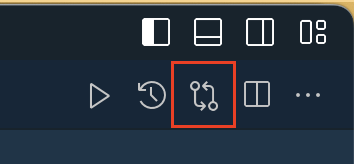
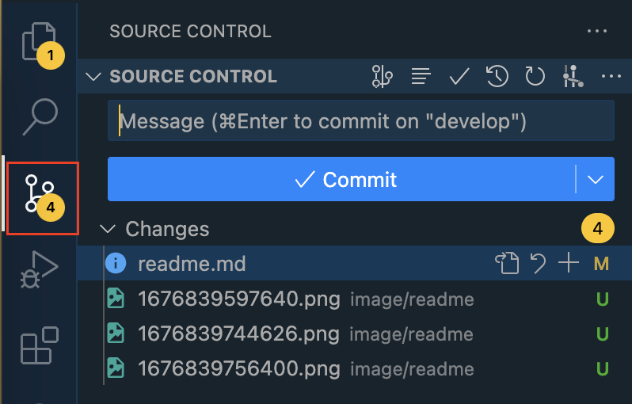
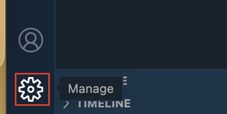
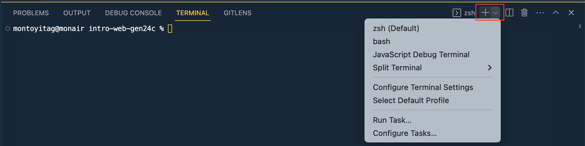
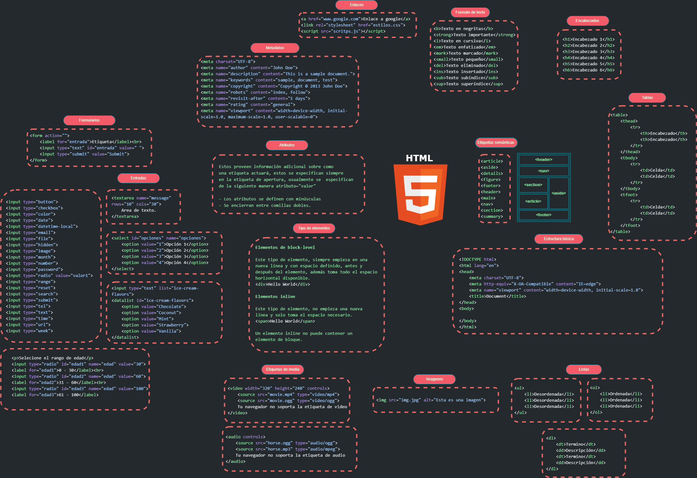
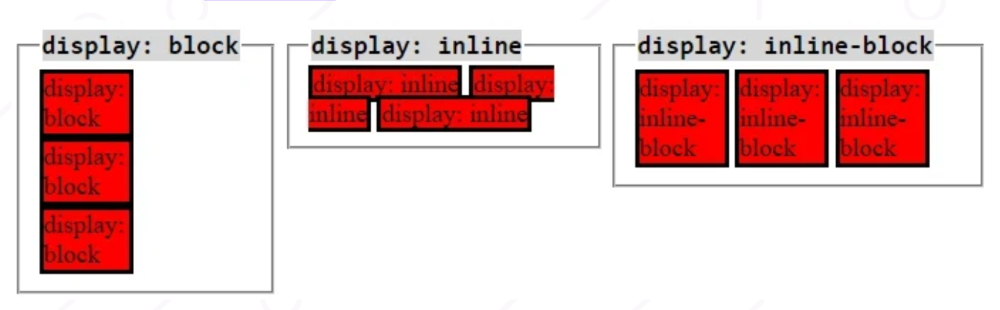
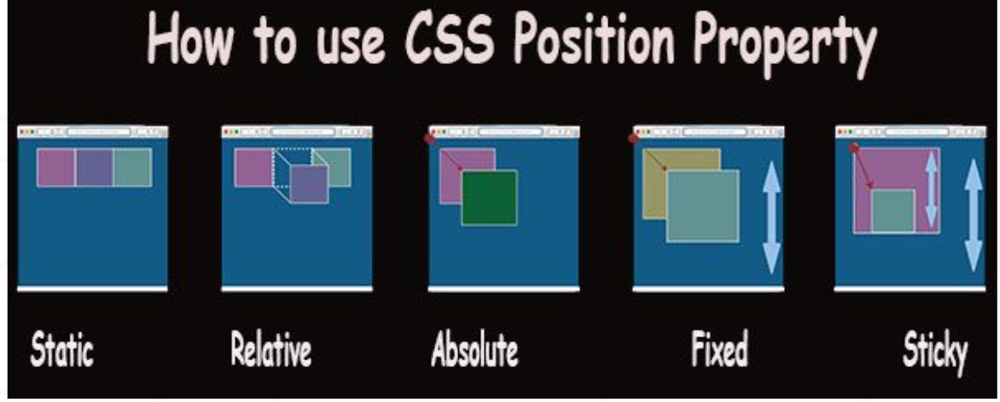
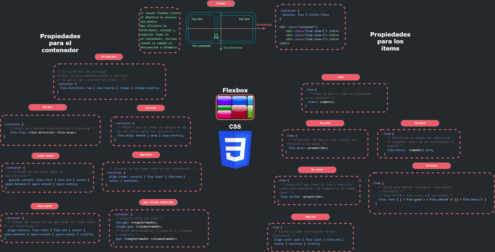
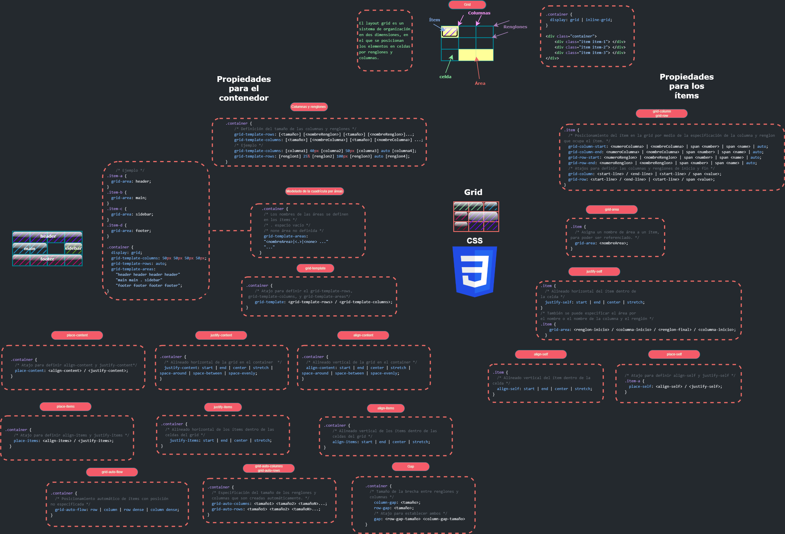

# Intro a la web

## Table of Contents

1. [Redes e Internet](#redes-e-internet)
2. [Desarrollo web](#desarrollo-web)
3. [VS Code](#vs-code)
4. [Terminal](#terminal)
5. [Git](#git)
6. [Github](#github)
7. [Navegador](#navegador)
8. [Html](#html)
9. [Css](#css)
10. [Flexbox](#flexbox)
11. [CSS Grid](#css-grid)
12. [Responsive design](#responsive-design)
13. [Best practices](#best-practices)
14. [Proyecto del modulo](https://docs.google.com/document/d/1s6y6oWGtIuyIuGL90d0rWuL8wQr6jo5jRlXx8nj7ChU/edit?usp=sharing)
15. [Glosario](#glosario)
16. [Path sugerido](#path-sugerido)
17. [Recursos y herramientas](#recursos-y-herramientas)
18. [Areas de estudio](#areas-de-estudio)

**Estructura de carpetas sugerida**

* kata-1
  * intro-web-gen24c
  * juanito-intro-web-gen24c
* kata-2
  * intro-js
  * juanito-intro-js

### Redes e internet

#### **¿Qué es una red?**

Es un conjunto de dispositivos informaticos y de software conectados entre sí por medio de dispositivos físicos que envían y reciben datos. Una red permite compartir información, recursos y ofrecer servicios.


#### **¿Qué es Internet?**

Es una  **red de computadoras interconectadas a nivel mundial en forma de telaaraña** . Consiste de servidores (o "nodos") que proveen información a a todo el mundo a través de las redes de telefonía y cable.

#### ¿Qué es la web?

Es la informacion que se encuentra en una dirección de internet.

#### **Arquitectura Cliente Servidor**

Es una arquitectura que representa una forma de abstraccion para la comunicacion entre dispositvos informaticos o software.

En una arquitectura Cliente-Servidor existe un **servidor** y **múltiples clientes** que se conectan al servidor para recuperar todos los recursos necesarios.

El cliente solo es una capa para representar los datos y se detonan acciones para modificar el estado del servidor, mientras que el servidor es el que hace todo el trabajo pesado.


NOTA: Considere que el modelo cliente servidor es una abstraccion. Cualquier cosa que solicite recursos puede ser considerada un cliente (computadora, celular, el navegador, una pagina web, codigo JS) y cualquier cosa que responda información o ponga a disposición un servicio es un servidor (computadora, celular, un API, etc.)

#### **Navegadores web**

Es un programa que permite ver la información que contiene una página web. El navegador interpreta el código en el que está escrita la página web y lo presenta en pantalla permitiendo al usuario interactuar con su contenido y navegar.

Un navegador interpreta 3 lenguajes para renderizar una pagina:

* **Html:** Para definir la estructura.
* **CSS:** Para estilizar el sitio.
* **JS:** Para volver funcional e interactiva la pagina web.

#### **¿Cómo funcionan los sitios web?**

El navegador como cliente solicita al servidor una url desde la que se descargan recursos (html, css, js, img, mp3, etc) y que interpreta para mostrarlos como una pagina web.

#### **Proveedores de Internet**

Un ISP (Internet Service Provider) generalmente es una empresa dedicada a ofrecer servicios de conexión de internet.

**Ejemplos**

* Izzy.
* Telmex.
* Megacable.
* Axtel.

#### **Dominio**

Un **dominio web** es el nombre único que recibe un sitio web en internet. En otras palabras, identifica a una página web concreta sin que puedan existir dos o más sitios web que compartan el mismo nombre de dominio.

A continuacion se muestran las partes de una url, donde se observa que parte corresponde al dominio.


* **Protocolo:** Un protocolo es el conjunto de reglas que se establecen para el uso de una determinada tecnologia. El protocolo http/https son protocolos para la comunicacion en internet (transferencia de hypertexto).
* **Path:** Es una ruta donde se ubican archivos en un servidor.

#### **Hosting**

Es el alojamiento que tiene un sitio web para poder ser accesible a traves de internet (desde cualquier parte del mundo). Es el servidor que responde una pagina web al acceder a una url.

#### **Direcciones IP**

Una direccion IP (Internet Protocol) es la representacion de un dominio mediante 4 octetos de bytes. Sirve para identificar un dispositvo en la red.

**Tipos de IP**

* **Privadas:** Direccion IP que identifica a un dispositivo en una red local (196.180.1.2).
* **Publicas:** Direccion IP que nos identifica en internet (231.138.1.197).

#### **Protocolo de configuracion dinámica de host**

**Dynamic Host Configuration Protocol (DHCP)**  asigna automáticamente direcciones IP a los equipos de la red. Todo dispositivo en la red tiene una **IP privada**, si esta conectado a internet tambien tendra una **IP pública**.

#### **Servidor de nombre de dominio**

Un Domain Name Server (DNS) «traduce» nombres inteligibles para las personas (nombres de dominio) en identificadores binarios (direcciones IP) asociados con los equipos conectados a la red, esto con el propósito de poder localizar y direccionar estos equipos mundialmente.


### Desarrollo web

Tecnologías y herramientas para el desarrollo (programación) web

#### **Front end**

* Lenguajes
  * HTML (De marcado de hypertexto).
  * CSS (De estilos en cascada).
  * JavaScript (Lenguaje de programacion).
* Frameworks
  * React.
  * Angular.
  * Vuejs.

#### **Back end**

* Lenguajes de programacion
  * Node.
  * Java.
  * Php.
  * Python.
  * C#.
  * Go.
* Frameworks
  * Express.
  * Spring.
  * Laravel.
  * Django.
  * .NET.
  * Gin.

#### **Gestores de base de datos**

* SQL
  * PostgresSQL.
  * MySQL.
  * SQLServer.
  * Oracle.
  * MariaDB.
* NO SQL
  * MongoDB.
  * DynamoDB.
  * Cassandra.

#### **¿Qué es frontend?**

Es el area de desarrollo enfocada en la construccion de un sitio web. Tanto del diseño y estructura, estilos (colores, fondos, tamaños, animaciones y efectos) e interactividad con los que el usuario opera.

Es todo el código que se ejecuta en el navegador, al que se le denomina una aplicación cliente, es decir, todo lo que el visitante ve y experimenta de forma directa.

#### **¿Qué es backend?**

El backend procesa la información que alimentará el fron tend. Es la capa de acceso a los datos, ya sea de un software o de un dispositivo en general, contiene la lógica tecnológica que hace que una página web funcione, lo que queda oculto a ojos del visitante.

Trabajar en este apartado supone algo totalmente diferente al frontend, ya que exige una lógica especial enfocada a la optimizacion de recursos, seguridad de un sitio, lecturar y escritura de datos, etc.

### VS Code

Es un editor de código fuente desarrollado por Microsoft. Es software libre y multiplataforma, está disponible para Windows, GNU/Linux y macOS. VS Code tiene una buena integración con Git, cuenta con soporte para depuración de código, y dispone de un sinnúmero de extensiones, que dan la posibilidad simplificar las tareas de codificacion y desarrollar para disitntos lenguajes.

#### **Editor de texto**

Es un [programa informático](https://es.wikipedia.org/wiki/Programa_inform%C3%A1tico "Programa informático") que permite crear y modificar [archivos digitales](https://es.wikipedia.org/wiki/Archivo_(inform%C3%A1tica)) compuestos únicamente por textos sin formato, conocidos comúnmente como [archivos de texto](https://es.wikipedia.org/wiki/Archivo_de_texto "Archivo de texto") o “texto plano”. En ocasiones tienen algunas herramientas para codificar, sin embargo se recomiendan para editar textos simple y buscar algun IDE si lo que se requiere es programar.

#### **Entorno de desarrollo Integrado**

Integrated Development Enviroment (IDE) es un software para el diseño de aplicaciones que combina herramientas del desarrollador comunes en una sola interfaz gráfica de usuario (GUI). Generalmente, un IDE cuenta con las siguientes características:

* **Editor de código fuente** : Editor de texto que ayuda a escribir el código de software con funciones como el resaltado de la sintaxis con indicaciones visuales, el relleno automático específico para el lenguaje y la comprobación de errores a medida que se escribe el código.
* **Automatización de las compilaciones locales**: Herramientas que automatizan las tareas sencillas y repetitivas como parte de la creación de una compilación local del software para que use el desarrollador, como la compilación del código fuente de la computadora en código binario, el empaquetado de ese código y la ejecución de pruebas automatizadas.
* **Depurador** : Programa que sirve para probar otros programas y mostrar la ubicación de un error en el código original de forma gráfica.
* **Extensiones / Plugins:** Son complementos para el IDE para ayudarnos con tareas como tener una terminal, autocompletar codigo, cambiar iconos, leer archivos especiales, etc.

#### **Extensiones recomendadas para vscode**

* Auto Rename Tag.
* Color info.
* Diff.
* EsLint.
* Live Share.
* Office Viewer (Markdown Editor)
* Peacock.
* vscode-pdf.
* Git Graph.
* Git Blame.

#### Herramientas de vscode que debes conocer

1. Comparador de cambios (esquina superior derecha).



2. Commits en vscode.



3. Buscar coincidencias de texto ( ctrl / command + f ).

   try!!!
4. Abrir archivos por nombre( ctrl / command + p ).

   try!!!
5. Ir a la configuración (ajustes) de vscode.



6. Abrir la terminal de comandos de vscode ( ctrl / command + j ).
7. Cambiar la terminal de vscode.

   

#### **VSC como editor predeterminado para git**

```
# establecer vscode como editor
git config --global core.editor"visual studio --wait"

# commit de prueba (sin -m para que abra un editor, deberia ser vscode)
git commit

# guardar el commit
cerrar el archivo que se abrio en vscode

# cancelar commit
regresar a la terminal y presionar ctrl + c
```

#### Lecturas recomendadas

* [IT Next - Atajos en VS Code](https://itnext.io/vs-code-shortcuts-to-code-like-youre-playing-a-piano-part-2-c27202ea7ea1).
* [Andy Bell - Custom Properties](https://andy-bell.co.uk/my-favourite-3-lines-of-css/).
* [Andy Bell - How the CSS box-sizing property works](https://andy-bell.co.uk/how-the-css-box-sizing-property-works/).
* [Cambia de HEX a RGB a HSL in segundos](https://www.kevinpowell.co/article/change-from-hex-to-rgb-to-hsl-in-seconds-with-vs-code/).

### Terminal

La terminal o consola es una forma generalizada de llamar a la interfaz de línea de comandos: una pantalla. Sirve para escribir comandos  con los que ordenamos al sistema realizar acciones concretas.

* [Guía para la Terminal enfocado a desarrolladores Frontend](https://www.joshwcomeau.com/javascript/terminal-for-js-devs/).

**Path**

Una ruta o path indica una ubicación a nivel de carpeta de algun fichero dentro del
sistema de archivos.

#### **Ejemplos de path**

```
/# Raiz
/

/# Significa ahi mismo
./

/# Regresar un nivel de carpetas../
../../

/# Ir la carpeta home
~/
```

#### Uso de comandos básicos

```
# imprime el path en el que se encuentra
pwd

# moverse entre carpetas
cd path

# listar carpetas y archivos que hay en el directorio actual
ls

# crear carpetas
mkdir newFolder

# crear archivos
touch nameFile.txt

# eliminar carpetas
rmdir folderName

# eliminar archivos
rm fileName.txt

# limpiar la pantalla
clear
```

#### **Ejemplos de uso del comando cd**

```
cd ..
cd ..
cd ..
cd myFolder
cd ../../../desktop
cd ~/
cd ./
```

#### **Otros comandos**

```
# comprobar conexion a un dominio/ip
ping www.google.com


# editor nano
nano archivo.txt

# ver un archivo
cat archivo.txt
```

**NOTA:** ctrl + c (detiene procesos en la terminal).

Cuando un comando lleva -x y letras son PARAMETROS de como se debe ejecutar.

### Git

Git es un sistema de control de versiones.

#### Configuraciones iniciales

```
# establecer un usuario global
git config --global user.name "juanito perez"


# establecer un correo global
git config --global user.email juanito.perez@example.com

# inicializar una carpeta como repositorio
git init
```

#### Información del repo

```
# ver estado del working directory y/o staging area
git status

# ver historial de commits
git log --oneline
```

#### Hacer un commit

```
# agregar al staging area
git add .

# quitar del staging area
git restore --staged namefile.txt

# hacer un commit al repo local
git commit -m "conventionalCommitScope: mi mensaje"

```

#### Administración de ramas

```
# ver rama en la que se encuentra el head
git branch 

# crea una rama nueva
git branch newBranchName 

# cambiarse a una rama con el nombre nombreRama
git checkout branchName

# crear y cambiarse a una nueva rama
git checkout -b newBranchName

# crear y cambiarse a una nueva rama
git switch -c newBranchName 

# eliminar una rama
git branch -D branchName

```

#### Otros comandos útiles

```
# Descarta los cambios del stagin y working directory
git reset --hard

# actualiza la cache de git para que tome ciertos cambios (.gitignore)
git rm --cached . r

# actualiza el mensaje del ultimo commit realizado (no debe estar pusheado)
git commit --amend -m "an updated commit message"

# stash: el codigo de working directory y staging area es eliminado temporalmente
git stash

# stash: el codigo de working directory y staging area que fue eliminado se recuperar
git stash pop

```

[Más info](https://www.conventionalcommits.org/en/v1.0.0/)

#### Buenas practicas para mensajes de commits

##### Commits Atómicos

Consiste en realizar un commit por un solo objetivo. Es decir, no mezclar muchas soluciones en el mismo commit.

##### Conventional Commits

Es una especificación sobre como escribir mensajes de confirmación (commits).

**Estructura una línea**

```
[optional scope]: [optional body][optional footer(s)]
```

**Esctructura multilínea**

```
feat: add hat wobble
^--^  ^------------^
|     |
|     +-> Resumen en tiempo presente (no deberia ser un listado).
|
+-------> Tipo: chore(tarea), docs(documentos), feat(logro), fix(corrección), refactor(refactorización), style(estilo), or test(prueba).

[optional footer(s)]
```

**Tipos principales**

* **feat:** Nuevas funcionalidades.
* **chore:** Cosas que no aportan un requerimiento funcional, generalmente son requerimientos no funcionales.
* **fix:** Corrección de errores.
* **docs:** Documentación o comentarios.
* **style:** Cambios de legibilidad o formateo de código que no afecta a funcionalidad.
* **refactor:** Modificaciones de código o arquitectura que no corrige errores ni añade funcionalidad, pero mejora la escritura y optimiza la funcionalidad.
* **test:** Para añadir o arreglar tests.

**Referencias**

- [Semantic commit messages](https://gist.github.com/joshbuchea/6f47e86d2510bce28f8e7f42ae84c716).
- [Conventional commits](https://www.conventionalcommits.org/).
- [Karma](http://karma-runner.github.io/1.0/dev/git-commit-msg.html).

#### Github

Github es el repositorio remoto a donde podemos respaldar el codigo. Los siguientes comandos funcioan para conectarse a cualquier repositorio remoto, nos sólo a github, por ejemplo gitlab o bitbucket.

#### Generar llave ssh

```
# generar ssh key
ssh-keygen

# ver llave pública
cat ~/.ssh/id_rsa.pub
```

#### Conexión al repo remoto

```
# ver los repos remotos a los que esta conectado el repo local
git remote -v

# agregar una direccion remoto (origin)
git remote add origin myUrl

# modificar una direccion remoto (origin)
git remote set-url origin myUrl
```

### Subir y bajar cambios

```
# bajar cambios
git pull origin branchNamesubir cambios

# git push origin branchName

# subir cambios de una rama nueva para el remoto
git push -u origin branchName

# obtener los cambios de una rama remota y cambiarse a esa rama

git fetch && git checkout develop
```

### Navegador

#### Uso del inspector de elementos

El inspector de elementos de Google Chrome / Mozilla es una herramienta muy útil para desarrolladores web, diseñadores y cualquier persona interesada en conocer el código fuente y la estructura de una página web.

Permite a los usuarios ver y manipular el código fuente y la estructura de una página web. El inspector de elementos también permite a los usuarios ver el estilo y diseño de una página web, incluyendo la hoja de estilos CSS y la disposición de los elementos en la página.

#### Cómo abrir el inspector de elementos

Para abrir el inspector de elementos en Google Chrome, sigue estos pasos:

1. Abre Google Chrome / Mozilla y navega a la página web que quieres inspeccionar.
2. Haz clic derecho en cualquier parte de la página web y selecciona "Inspeccionar" en el menú desplegable.
3. O bien, utiliza el atajo de teclado `Ctrl+Shift+I` (Windows, Linux) o `Cmd+Option+I` (Mac) para abrir el inspector de elementos.

#### Cómo utilizar el inspector de elementos

Una vez que hayas abierto el inspector de elementos, verás una ventana dividida en dos secciones: en la parte izquierda se encuentra el código fuente de la página web, y en la parte derecha se muestra una vista previa de la página web.

Aquí tienes algunos de los usos más comunes del inspector de elementos:

##### 1. Inspeccionar el código fuente

El inspector de elementos permite a los usuarios ver el código HTML y CSS de una página web. Para inspeccionar un elemento específico, haz clic en él en la vista previa de la página web o en el código fuente, y se resaltará en ambas secciones. También puedes navegar por el código fuente utilizando las teclas de flecha del teclado.

##### 2. Modificar el código y ver los cambios en tiempo real

El inspector de elementos permite a los usuarios modificar el código HTML y CSS de una página web y ver los cambios en tiempo real en la vista previa de la página web. Para hacer esto, simplemente haz clic en el código fuente y edita el código directamente. Los cambios se aplicarán automáticamente a la vista previa de la página web.

##### 3. Depurar errores

El inspector de elementos también se puede utilizar para depurar errores en una página web. Por ejemplo, si un elemento no se muestra correctamente o no funciona como debería, puedes utilizar el inspector de elementos para encontrar y solucionar el problema. Al seleccionar un elemento, el inspector de elementos mostrará información sobre el elemento, incluyendo los estilos CSS aplicados, los eventos asociados y los errores en el código.

##### 4. Emular dispositivos móviles

El inspector de elementos también permite a los usuarios emular diferentes dispositivos móviles para ver cómo se verá una página web en diferentes tamaños de pantalla. Para hacer esto, haz clic en el icono de dispositivos móviles en la esquina superior izquierda del inspector de elementos y selecciona un dispositivo.

### Html

#### Etiquetas




### Css

#### Uso


#### Anotomia de una regla


#### Selectores

##### Lista de selectores basicos

```
# selector universal
/* aplica a todo el documento */
* {

}

# selector de una etiqueta
/* aplica a <tag></tag> */
tag {
  // css rules
}

# selector de clase
/* aplica a <div class="class-name"></div> */
.class-name {
  // css rules
}

# selector de id
/* aplica a <div class="myId"></div> */
#myId {
 // css rules
}

# selector de atributo
/* aplica a <a href="www.google.com"></div> */
a[href="www.google.com"] {
  // css rules
}

# pseudoclase que representa a la etiqueta html
/* funciona como html {}  */
:root
```

##### Selectores combinados

```

# descendiente
div p {
 /* todos los p dentro de div */
}

# hijo directo
div > p {
 /* el p dentro de un div */
}

# elemento adyacente
div + p {
  /* Selecciona la etiqueta hermana de la primera */
}

# general de hermanos
div ~ p {
  /* todos los hermanos de p denro de div */
}
```

##### Pseudoclases

Una **pseudoclase CSS** es una palabra clave que se añade a los selectores y que especifica un estado especial del elemento.

| Pseudo-Clases |
| ------------- |
| :hover        |
| :link         |
| :active       |
| :target       |
| :not(s)       |
| :focus        |

```

# selector:pseudoclase { propiedad: valor; }
div:hover {
  background-color: #F89B4D;
}
```

##### Pseudoelementos

Permiten añadir estilos a una parte concreta del documento.

| Pseudo-Elementos |
| ---------------- |
| :first-letter    |
| :first-line      |
| :before          |
| :after           |
| :selection       |

```

# selector::pseudo-elemento { propiedad: valor; }
ul li::after {
    color: #21acde;
    content: " | ";
    display: inline-block;
  }
```

**Nota:** Solo se puede usar un pseudo-elemento por selector. Debe aparecer después del selector simple.

#### Herencia

La herencia en CSS consiste en que si dos estilos tienen la misma jerarquia, se aplica el estilo que aparece mas cercano al elemento, sobreescribiendo a sus padres.

#### Especificidad

La especificidad en CSS es un grupo de reglas aplicadas a los selectores CSS para determinar qué estilo se aplica a un elemento. Cuanto más específico sea un selector, mayor será su valor en puntos y más probable será que esté presente en el estilo del elemento.

| Peso  | Especificidad                   |
| ----- | ------------------------------- |
| X0000 | !important                      |
| -X000 | inline                          |
| --X00 | id                              |
| ---X0 | clases, atributos, pseudoclases |
| ----X | elementos y pseudolementos      |
| ----- | selector universal              |

[Especificidad en CSS: Qué es y como funciona](https://dev.to/lupitacode/especificidad-en-css-que-es-y-como-funciona-52k6)

#### Box model


**NOTA:** El valor `border-box` en el `box-sizing` hace que el `padding` y el `border` pasen a formar parte del cálculo del ancho de la caja y no lo suman posteriormente.

#### Displays



#### **Positions**




#### Unidades

Las medidas en CSS determinan el tamaño de los elementos, existen de do tipos:

* **Absolutas:** Son medidas que no están referenciadas a ninguna otra unidad, es decir, no dependen de un valor de referencia. Son unidades de medidas definidas por la física, como el  **píxel** , centímetro, metro, etc.
* Relativas: Se calculan en base a otra unidad de medida definida, por ejemplo **em** y **rem**. l uso de ellas es más apropiado para que podamos hacer ajustes en diferentes dispositivos asegurando un layout consistente y fluido en distintas medias.


[Guia de unidades en CSS](https://www.aluracursos.com/blog/guia-de-unidades-en-css)


#### Listado de propiedades mas usadas

* [¿Conoces cuáles son las propiedades mas utilizadas en CSS?](https://blog.mgpanel.org/post/-conoces-cuales-son-las-propiedades-mas-utilizadas-en-css-).


### Flexbox



### CSS Grid



### Responsive design

**E****s** **una ****técnica** de diseño web **que busca** **la correcta visualización de una misma página en distintos dispositivos.** Desde ordenadores de escritorio a tablets y móviles.

#### Técnicas de diseño responsivo

* Uso de viewport en la etiqueta metatag.
* Uso de Media Queries.
* Uso de Max-Width y Min-Width.
* Uso de medidas relativas.
* Tamaño de fuente en un diseño responsive.
* [Otras técnicas](https://www.ondho.com/las-9-tecnicas-para-hacer-tu-sitio-web-100-responsive/).

#### **Ventajas**

* Incremento en el número de visitas.
* Integra todos tus servicios en un solo sitio web.
* Incrementa la visibilidad para los buscadores.
* Ahorra tiempo, no es necesario desarrollar aplicaciones distintas por dispositivo.
* Es más sencillo administrar tu sitio.
* Los diseños responsivos son más sencillos de mantener ya que no involucran ningún componente del lado del servidor.
* Solo hay que modificar el CSS.

#### **Media query**

Es una regla o conjunto de reglas que se introducen en una hoja de estilo CSS con el objetivo de definir propiedades específicas para distintos tipos de pantallas.

* [Media Queries](https://developer.mozilla.org/es/docs/Web/CSS/Media_Queries/Using_media_queries).
* [Capitulo 9 Media queries](https://www.arkaitzgarro.com/css3/capitulo-9.html).
* [Guía de diseño responsivo (2023)](https://ishadeed.com/article/responsive-design/).
* [Diseño responsivo](https://web.dev/new-responsive/).

### Best practices

#### Tips básicos para html/css

1. Usar rem como medida, pero primero reseteandola a pixeles ya que su base es 16px = 1 rem.

```
html {
    font-size: 62,5%;
}
```

2. Resetear los valores del html para evitar margin, padding y border por defecto. Asi mismo se recomienda trabajar con box-sizing de tipo border box para que cada caja considere el margin, padding y border como parte del width y heigth (por defecto solo es el padding)).

```
html {
  margin: 0;
  padding: 0;
  border: 0;
  box-sizing: border-box;
}
```

3. Utilizar el selector root para establecer variables con ayuda de los custom properties.

```
:root {
  --first-color: #16f;
  --second-color: #ff7;
}

#firstParagraph {
  background-color: var(--first-color);
  color: var(--second-color);
}
```

#### Nomenclaturas

* [Naming Conventions - BEM](https://www.freecodecamp.org/news/css-naming-conventions-that-will-save-you-hours-of-debugging-35cea737d849/).
* [Naming Conventions - by Scaler](https://www.scaler.com/topics/css-class-naming-convention/).
* [CUBE -  Composition Utility Block Exception](https://cube.fyi).
* [BEM - Block, Element, Modifier](https://en.bem.info/methodology/).

#### Usabilidad

* [Usabilidad web: qué es y 6 recomendaciones para mejorarla](https://www.inboundcycle.com/diccionario-marketing-online/usabilidad-web)

### Proyecto del módulo

Se encuentra en google drive...

### Glosario

* **Buena práctica:** Es una actividad que se ha demostrado que funciona bien y produce buenos resultados, y, por lo tanto, se recomienda como modelo.
* **Carpeta home:** carpeta de su usuario /Users/montoyitag (~/)
* **Carpeta raíz:** Es la base de nuestro disco duro. Por ejemplo: disco C:\ o en linux /
* **Cliente:** Es quien solicita información dentro de un sistema informático.
* **DNS:** Es un tipo de servidor de redes de computadora que se encarga de convertir direcciones web en dominios IP y viceversa. Ejemplo: 8.8.8.8 => www.google.com
* **Dominio:**  Es una dirección web compuesta por un nombre de sitio web y una extensión de dominio. Ejemplo: google.com
* **Dummy:** Es un dato o elemento de prueba, sirve para simular datos.
* **Estándar:** Es un patrón o modelo a seguir, generalmente derivado de un documento o certificación.
* **Hosting:** Un hosting  **es un servicio de alojamiento para páginas web bajo un servidor** .
* **Internet:** Red conformada por todas las redes del mundo para comunicarse y compartir información.
* **Ip:** La dirección IP es una etiqueta numérica, por ejemplo "192.0.10.1" que identifica, de manera lógica y jerárquica, a una interfaz en la red. Existen IP públicas y IP privadas.
* **Kernel:** El kernel es el núcleo de un sistema operativo y, por tanto, la interfaz (middleware) entre el software y el hardware.
* **Mockup:** En diseño es un bosquejo o representación de una vista o maqueta, en programación es información de prueba.
* **Path:** Es una ruta o dirección donde se encuentra alojado un recurso en un sistema de archivos. Existen rutas relativas como ../../my-docs o absolutas como C:\users\juan\Documents\tarea\tesis.doc
* **Plugin:** Software pequeño que sirve como complemento de otro para un fin en específico.
* **Proceso:** Cualquier tarea que ocurre en nuestro informático.
* **Proceso en segundo plano:** Es un proceso en el que el usuario no tiene que hacer algo para que suceda.
* **Prototipo:** Es una representación aparente pero concreta de parte o la totalidad de una idea de negocio o sobre un producto o servicio.
* **Puerto:** un lugar donde se abre una conexión para acceder a un servicio.
* **Requerimiento funcional:** Son features que el usuario o negocio requieren para su proyecto de software. Aportan un valor operativo.
* **Requerimiento no funcional:** Son features que no aportan un valor operativo pero si son requeridos para que el software funcione correctamente (seguridad, despliegue, pruebas, etc.).
* **Red de computadoras:** Conjunto de computadoras interconectadas entre sí para compartir datos y servicios.
* **Scaffolding:** Estructura de carpetas y archivos de un proyecto de desarrollo.
* **Servidor:** Es una instancia fisica o lógica que responde peticiones (request).
* **Sistema operativo:** Es el software que coordina y dirige todos los servicios y aplicaciones que utiliza el usuario en una computadora.
* **URL:** Es una dirección web compuesta por al menos el protocolo, dominio y ruta.
* **Viewport:** En términos de navegadores web, se refiere a la parte del documento que usted está viendo en el momento, es el ancho y alto de navegador en un momento del tiempo.
* **Web:** Conjunto de información que se encuentra en una dirección determinada de internet.
* **Wireframe:** Es una representación visual de un sitio web.
* **World Wide Wibe:** Es un sistema que funciona a través de internet, por el cual se puede transmitir contenido basado en estándares web.

### Path sugerido

* Entender como funciona a alto nivel el internet y el navegador.
* Repaso de herramientas y shorcuts de vscode.
* Comandos de terminal.
* Entendimiento del funcionamiento de git (staging area, working directory y repo local).
* Repaso de comandos git (stage y unstaged commits, conexion remoto remoto, subir y bajar cambios, crear y bajar ramas, moverse entre commits).
* Html y css (leer la documentación).
* Investigar buenas prácticas de diseño web.
* **Siguiente kata:**
  * Leer sobre lógica de programación (diagramas de flujo y pseudocodigo).
  * Documentación de JavaScript.
  * Repasa, repite, prácticar, empaparse de todos lados.
  * Formarse un criterio propio y estar dispuesto a reaprender.

#### Paths para front end

* [Roadmap.sh](https://roadmap.sh/)
* [Roadmap Desarrollador Frontend](https://roadmap.sh/frontend)
* [Roadmap Frontend Performance](https://roadmap.sh/best-practices/frontend-performance)

### Recursos y herramientas

##### Documentación

* [W3Schools](https://www.w3schools.com/).
* [Mozilla Developer Network](https://developer.mozilla.org/es/).
* [CSS Tricks - A Complete Guide to Flexbox](https://css-tricks.com/snippets/css/a-guide-to-flexbox/).
* [CSS Tricks - A Complete Guide to Grid](https://css-tricks.com/snippets/css/complete-guide-grid/).
* [SoloLearn.](https://www.sololearn.com/)
* [TutorialesYa.](https://www.tutorialesprogramacionya.com/)
* [CSS Handbook](https://fjolt.com/series/learn-css).

##### Artículos

* [Mejores Prácticas HTML](https://www.freecodecamp.org/news/html-best-practices/).
* [Como escribir HTML Semántico](https://hackernoon.com/how-to-write-semantic-html-dkq3ulo).
* [Exploring the Complexities of Width and Height in CSS](https://css-tricks.com/exploring-the-complexities-of-width-and-height-in-css/).
* [What’s the Difference Between Flexbox and Grid](https://css-tricks.com/quick-whats-the-difference-between-flexbox-and-grid/).
* [Formatos de colores en CSS](https://www.joshwcomeau.com/css/color-formats/).
* [Unidades en CSS y accesibilidad](https://www.joshwcomeau.com/css/surprising-truth-about-pixels-and-accessibility/).
* [Josh Comeau CSS Reset](https://www.joshwcomeau.com/css/custom-css-reset/).
* [Kevin Powell CSS remedy](https://www.kevinpowell.co/article/css-remedy/).
* [Como inspeccionar tu CSS](https://www.kevinpowell.co/article/debug-css-5-devtool-features/).
* [Kevin Powell&#39;s Newsletter](https://www.kevinpowell.co/newsletter/).

#### Diseñar prototipos de maquetas

* [Figma: ](https://www.figma.com/)Software para prototipos de baja y alta fidelidad.
* [Canva: ](https://www.canva.com/)Software para hacer diseños o diagramas.
* [Lucidchart: ](https://www.lucidchart.com/)Software para crear diagramas.
* [Design Course (juego](https://designcourse.com/app/course/ueye)[)](https://designcourse.com/app/course/ueye): Juego donde se identifican elementos importantes dentro del diseño UI.
* [Dribbble.com](https://dribbble.com/shots/popular/web-design): Explora tendencias de Diseño Web, Diseño Responsivo, UX/UI.
* [awwwards.com](https://www.awwwards.com/websites/): Sitio web que reconoce y promueve el talento y esfuerzo de los mejores desarrolladores, diseñadores y agencias web del mundo.
* [Bëhance](https://www.behance.net/search/projects?search=web%20design&tracking_source=typeahead_search_suggestion): Red para mostrar y descubrir trabajo creativo.
* [Huemint.com](https://huemint.com/website-1/): Paleta de colores.
* [Coolors.com](https://coolors.co/): Paleta de colores.
* [Haikei](https://haikei.app/): Generador de svg’s.
* [Clippy](https://bennettfeely.com/clippy/): Generador de `clip-path` .
* [Spline](https://spline.design/): Herramienta de diseño para creación de escenas, materiales y modelos 3D.

#### Practicar para html/css

* [Frontend Mentor](https://www.frontendmentor.io/): Página con proyectos a realizar en donde se pide resolver problemas reales con HTML, CSS y JavaScript.
* [CSSBattle](https://cssbattle.dev/): Juego donde se requiere escribir HTML y CSS para replicar una imagen objetivo.
* [Guía Interactiva de Flexbox](https://www.joshwcomeau.com/css/interactive-guide-to-flexbox/): Al final de esta pagina hay una suscripción al Newsletter de Josh Comeau.
* [Flexbox Zombies](https://mastery.games/flexboxzombies/).
* [Juego CSS Flexbox Froggy](https://flexboxfroggy.com/).
* [Guía Interactiva de CSS Grid](https://fjolt.com/article/a-guide-to-css-grid).
* [CSS Grid Garden](https://cssgridgarden.com/) (juego).
* [Using Grid Named Areas to Visualize (and Reference) Your Layout](https://css-tricks.com/using-grid-named-areas-to-visualize-and-reference-your-layout/).
* [Learn CSS Grid](https://learncssgrid.com/).

#### Practicar live coding

* [CodePen.](https://codepen.io/)

#### Prácticar lógica de programación

* [Codewars.](https://www.codewars.com/)
* [Codesignal.](https://codesignal.com/)
* [Hacker rank.](https://www.hackerrank.com/)

#### Otras herramientas online

* [Gitignore generator](https://www.toptal.com/developers/gitignore): Generador de archivos gitignore.
* [Can I Use](https://caniuse.com/): Provee información actualizada del soporte de los navegadores (desktop y mobile) hacia tecnologías usadas en el Frontend.

#### **Redes sociales para estudiar**

##### Youtube

* [Fazt.](https://www.youtube.com/c/FaztTech)
* [Absolute.](https://www.youtube.com/c/AbsoluteSite)
* [MidudeDev](https://www.youtube.com/c/midudev).
* [Carlos Azaustre.](https://www.youtube.com/c/CarlosAzaustre)
* [CodelyTV.](https://www.youtube.com/c/CodelyTv)
* [Música para codear](https://www.youtube.com/c/CodePioneers).
* [Kevin Powell](https://www.youtube.com/@KevinPowell).
* [FreeCodeCamp.com](https://www.youtube.com/@freecodecamp).
* [Web Dev Simplified](https://www.youtube.com/@WebDevSimplified).
* [DesignCourse](https://www.youtube.com/@DesignCourse).
* [Wes Bos](https://www.youtube.com/@WesBos).
* [Figma](https://www.youtube.com/@Figma).

##### Redes sociales

* [Medium.](https://medium.com/)
* [Carlos Azaustre.](https://www.instagram.com/carlosazaustre/?hl=es)
* [Richwebdeveloper](https://www.instagram.com/richwebdeveloper/?hl=es)
* [Vertechie](https://www.instagram.com/veritechie/?hl=es).
* [AnnCode](https://www.instagram.com/anncode/?hl=es).
* [Manz](https://twitter.com/Manz).
* [Javascript.tips](https://www.instagram.com/javascript.tips/).
* [webdev_guru](https://www.instagram.com/webdev_guru/).
* [richwebdeveloper](https://www.instagram.com/richwebdeveloper/).
* [amaizingfarooqq](https://www.instagram.com/amazingfarooqq/).
* [webdesignuniversity](https://www.instagram.com/webdesignuniversity/).
* [faizan.webappdev](https://www.instagram.com/webdesignuniversity/).
* [sobrecodigo](https://www.instagram.com/sobrecodigo/).
* [programmers_community_](https://www.instagram.com/programmers_community_/).
* [Lupita code](https://twitter.com/lupitacode).

##### YouTube Videos

* [5 simples formas para crear plantillas responsivas](https://www.youtube.com/watch?v=VQraviuwbzU)
* [Introducción al Diseño Web Responsivo](https://www.youtube.com/watch?v=srvUrASNj0s)
* [Variables en CSS](https://www.youtube.com/watch?v=lgaxU7CRmxU)
* [10 Conceptos avanzados de diseño responsivo](https://youtu.be/TUD1AWZVgQ8)
* [Organización de propiedades en CSS](https://youtu.be/3Y03OSNw6zo)
* [Youtube Shorts Playlist](https://youtube.com/playlist?list=PLaRUOCUDRB68bnvWDDkCuqBz5augfsADH)

##### TikTok Accounts

* [VSCode](https://www.tiktok.com/@vscode?lang=en).
* [mydudev](https://www.tiktok.com/@midudev?lang=en).
* [Wes Bos](https://www.tiktok.com/@wesbos?lang=en).
* [JavaScript Wizz](https://www.tiktok.com/@javascript_wizz?lang=en).
* [Kevin Powell](https://www.tiktok.com/@kevinpowellcss?lang=en).
* [Figma](https://www.tiktok.com/@figmaofficial?lang=en).

### Areas de estudio

##### Lógica de programación

Area de la programación enfocada en formar el aprendizaje logico matematicos para aplicarlo en la solucion de algoritmos por medio de distintas representaciones (lenguaje natural, diagramas de flujos, pseudocódigo y código).
